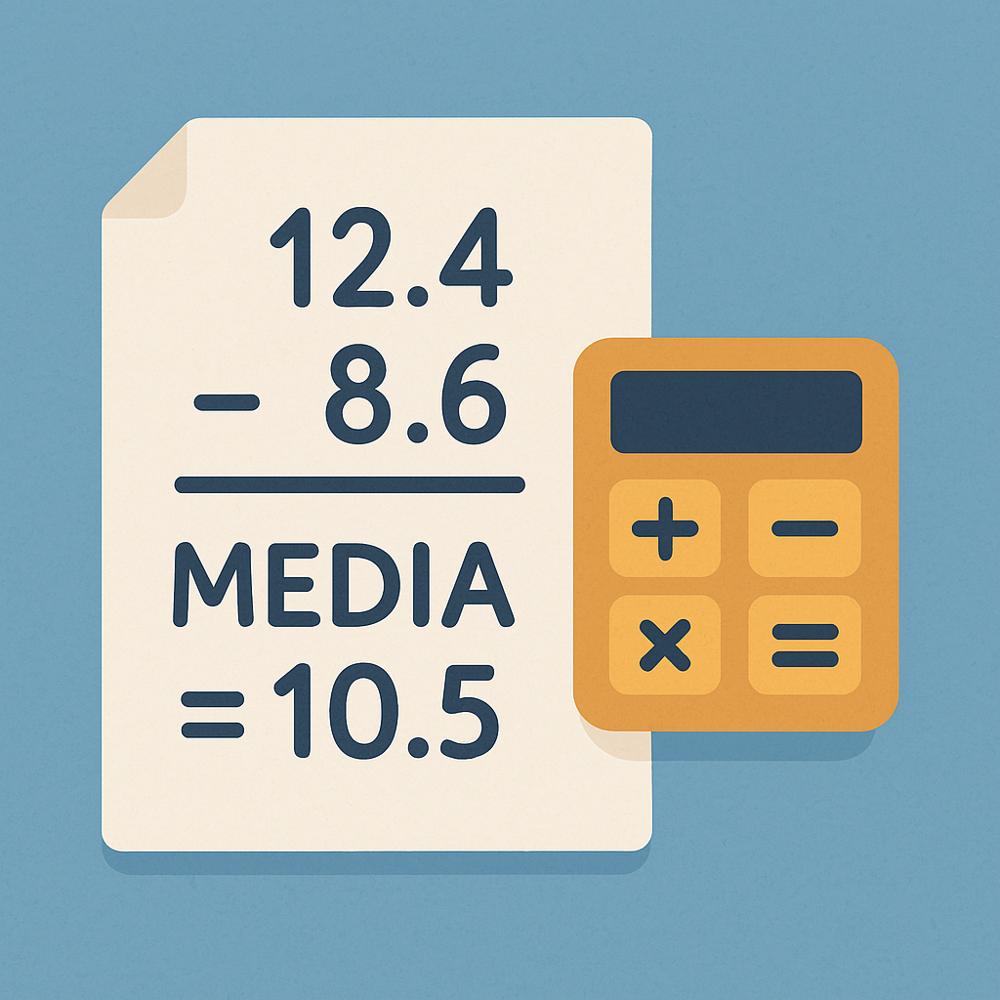

# Calculadora de Média Ponderada

## 📝 Descrição
Aplicativo console em C# que calcula a média ponderada de dois valores com pesos 3.5 e 7.5 respectivamente.

## 🚀 Como Executar

### Pré-requisitos
- .NET Core 3.1 ou superior instalado

### Passo a Passo
1. Abra o terminal na pasta do projeto
2. Execute:
   ```bash
   dotnet run
Insira os dois valores quando solicitado

⚙️ Fórmula de Cálculo
Copy
Média = (valor1 × 3.5 + valor2 × 7.5) / (3.5 + 7.5)
📊 Exemplo
Entrada:

Copy
5.0
7.1
Saída:

Copy
MEDIA = 6.43182
📂 Estrutura
Copy
Media_2_Numeros/
├── Program.cs          # Lógica principal
├── Media_2_Numeros.csproj # Configuração
└── Media_2_Numeros.sln    # Solução
📜 Licença
Livre para uso e modificação
